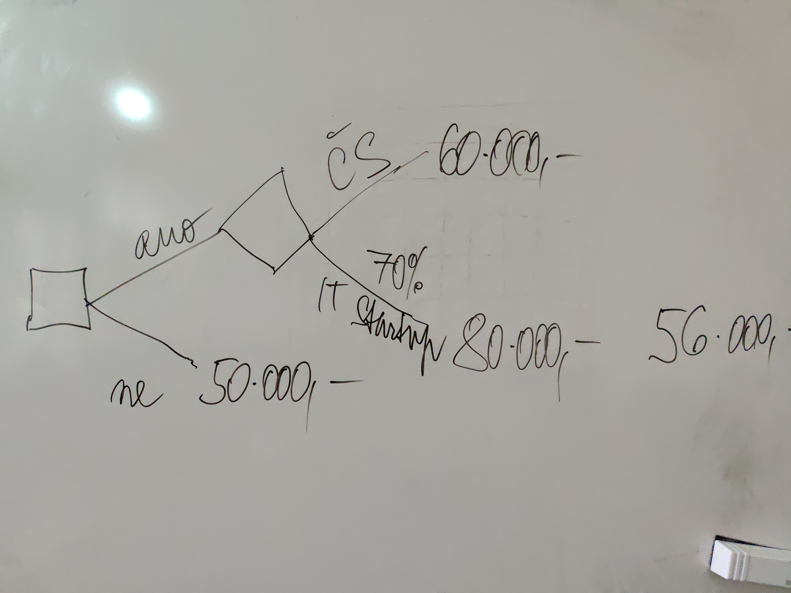

# Návrh počítačových her - Poznámky

## Otázky 221202

- Jaký osud PC hry? **->** Návrhář hry doporučí, jaký vývojový framework/jazyk mají
  vývojáři použít.
- Termín odevzdání a rozsah. **->** Odevzdání den před zkouškou. Budou vypsány 2
  termíny + PowerPoint prezentace o pár slidech.
- Insight Maker povinný? **->** Není povinný pokud nemáme v multiagentní v návrh,
  nemusíme používat.
- Herní pomůcky: mohou být in-game? **->** Je možné použít tokeny a těžební
  nástroje.
- Máme nakreslit i logiku hry jako je prezentaci? **->** Možné v Twine.
- Část rozvoje příběhu. **->** Twine - je možné v něm zobrazit progress hráče.
- Vyjádření matematckými modely. Jak moc to musí být "formální"?
- Datový model hry: I/O. **->** Je to volitená složka. Může se vyjádřit formou
  tabulky:
  
| Nástroj | Množství tokenů | Čas      |
| :-      | :-              | :-       |
| Sekyrka | 0,4             | 4 hodiny |
| Pila    | 2,0             | 4 hodiny |

- Možnost přídání rozhodovacího stromu. **->** Rozhodnutí hráče výhody/nevýhody

- Čemu hra učí. **->** Ekonomické myšlení. Investice. Matematické myšlení.
- Hra s nulovým součtem **->** Na každého vítěze připadá poražený.
- Hra s nenulovým součtem **->** Může být více vítězů a žádný poražený
- Opakovaná hra **->** Hra se pokaždé opakuje a hráči volí strategii na minulých
  rozhodnutích.
